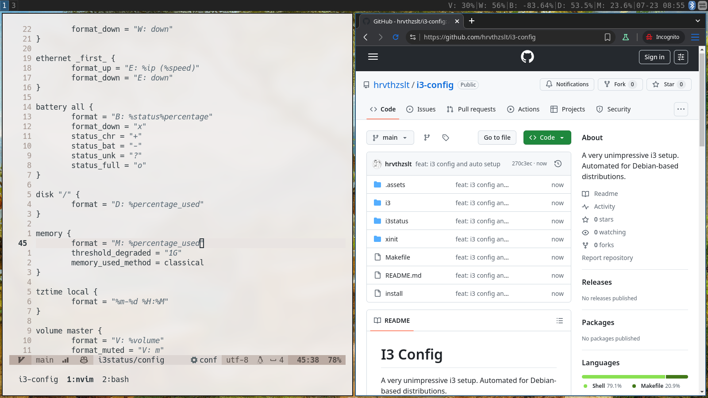

# I3 Config

A very unimpressive i3 setup. Automated for Debian-based distributions.



## Setup

Install dependencies and link configurations

```shell
make setup
```

Install dependencies

```shell
make install
```

Link configurations

```shell
make link
```

## Keybindings

### System Controls

- `$mod+Shift+s` - Lock screen and suspend
- `$mod+r` - Restart i3 (also reruns autorandr and nitrogen)
- `$mod+Shift+q` - Exit i3/logout

### Applications

- `$mod+Return` - Open terminal (alacritty)
- `$mod+p` - Open application launcher (dmenu)
- `$mod+w` - Open web browser (thorium-browser)
- `$mod+o` - Open file manager (thunar)
- `$mod+n` - Open network manager
- `$mod+u` - Open bluetooth manager
- `$mod+s` - Open screen layout editor (arandr)
- `$mod+v` - Open volume control (pavucontrol)
- `$mod+a` - Close notifications

### Window Management

- `$mod+q` - Close focused window
- `$mod+h/j/k/l` - Change focus (left/down/up/right)
- `$mod+Arrow keys` - Move focused window
- `$mod+Shift+h/j/k/l` - Resize window
- `$mod+f` - Toggle fullscreen
- `$mod+e` - Toggle split orientation
- `$mod+d` - Toggle tabbed
- `$mod+Shift+space` - Toggle floating mode
- `$mod+space` - Toggle focus between tiling/floating windows
- `$mod+1/2/3/4` - Switch to workspace 1/2/3/4
- `$mod+Shift+1/2/3/4` - Move window to workspace 1/2/3/4
- `$mod+minus` - Increase gaps
- `$mod+Shift+minus` - Decrease gaps

### Hardware Controls

- `Print` - Take screenshot with flameshot
- Volume keys - Control volume
- Brightness keys - Control screen brightness
